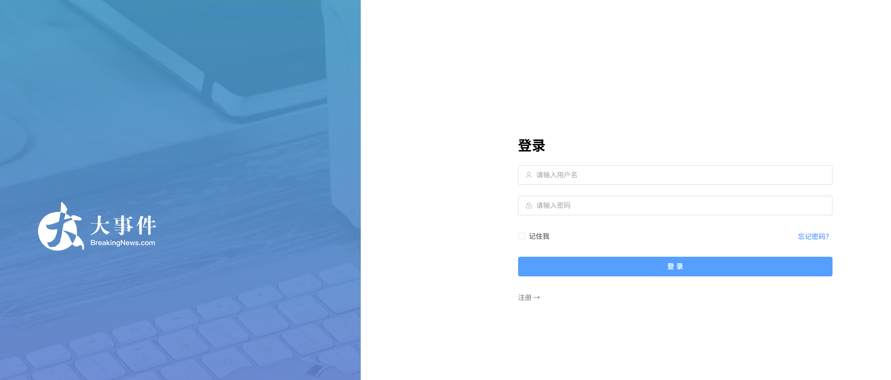
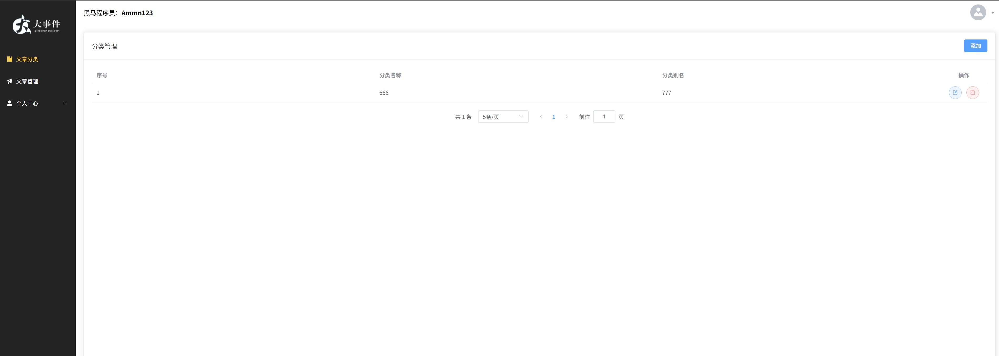
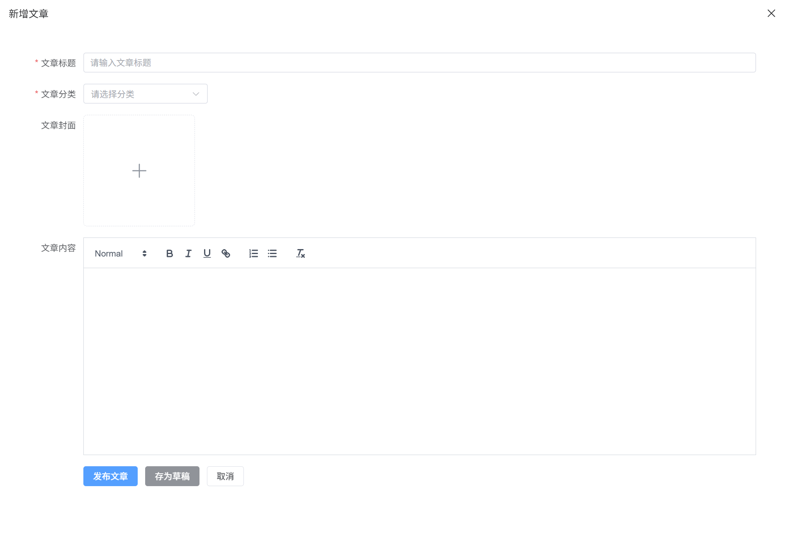
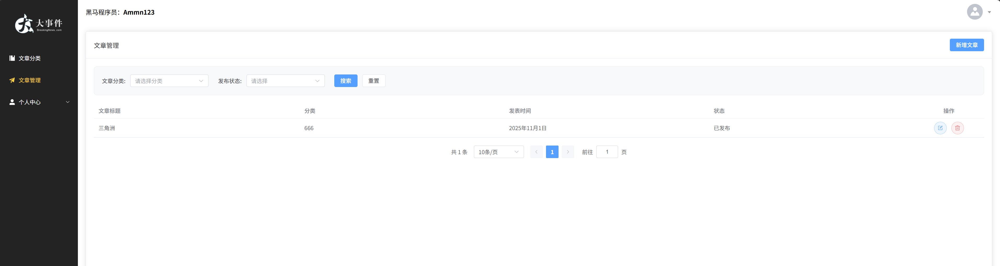
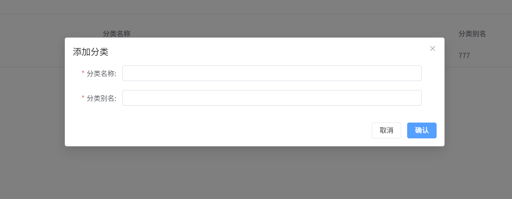
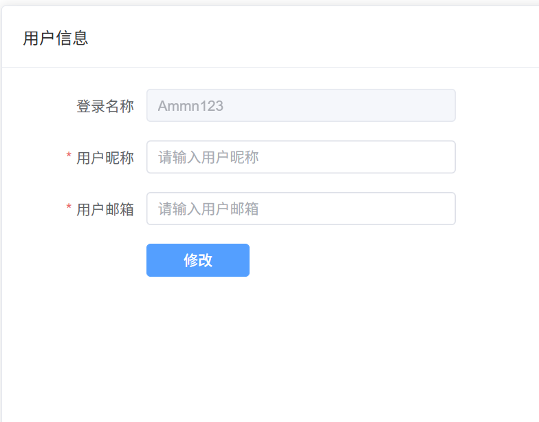

# 📰 Vue 大事件 - 项目技术文档

> 基于 Vue 3 + Vite + Element Plus 的现代化文章管理系统

---

## 📑 目录

- [项目概述](#项目概述)
- [项目演示](#项目演示)
- [技术栈](#技术栈)
- [项目结构](#项目结构)
- [核心功能](#核心功能)
- [技术实现详解](#技术实现详解)
- [开发指南](#开发指南)
- [部署说明](#部署说明)

---

## 项目概述

Vue 大事件是一个功能完善的文章内容管理系统（CMS），提供了用户认证、文章分类管理、文章发布与编辑、个人信息管理等核心功能。项目采用最新的 Vue 3 技术栈，注重代码质量、用户体验和性能优化。

### 项目特点

- ✅ **现代化技术栈**：Vue 3 + Vite + Pinia + Element Plus
- ✅ **完整的工程化配置**：ESLint + Prettier + Husky
- ✅ **智能缓存机制**：减少不必要的网络请求
- ✅ **组件化设计**：高度封装，易于维护
- ✅ **响应式布局**：支持移动端、平板、桌面端
- ✅ **状态持久化**：刷新页面不丢失数据

---

## 项目演示

### 📱 登录注册

<div align="center">
  
  
</div>

### 📝 文章管理

<div align="center">
  
  
</div>

<div align="center">
  
  
</div>

### 👤 个人中心

<div align="center">
  
</div>

---

## 技术栈

### 核心框架

| 技术       | 版本   | 说明                   |
| ---------- | ------ | ---------------------- |
| Vue        | 3.5.18 | 渐进式 JavaScript 框架 |
| Vite       | 7.0.6  | 新一代前端构建工具     |
| Vue Router | 4.5.1  | 官方路由管理器         |
| Pinia      | 3.0.3  | Vue 官方状态管理库     |

### UI 框架

| 技术                    | 版本   | 说明                |
| ----------------------- | ------ | ------------------- |
| Element Plus            | 2.10.5 | 基于 Vue 3 的组件库 |
| @element-plus/icons-vue | 2.3.2  | Element Plus 图标库 |
| @vueup/vue-quill        | 1.2.0  | 富文本编辑器        |

### 工具库

| 技术                        | 版本   | 说明             |
| --------------------------- | ------ | ---------------- |
| Axios                       | 1.11.0 | HTTP 客户端      |
| pinia-plugin-persistedstate | 4.4.1  | Pinia 持久化插件 |

### 开发工具

| 技术                    | 版本   | 说明             |
| ----------------------- | ------ | ---------------- |
| ESLint                  | 9.31.0 | 代码检查工具     |
| Prettier                | 3.6.2  | 代码格式化工具   |
| Husky                   | 8.0.0  | Git hooks 工具   |
| lint-staged             | 16.1.4 | Git 暂存文件检查 |
| unplugin-auto-import    | 20.0.0 | API 自动导入     |
| unplugin-vue-components | 29.0.0 | 组件自动导入     |

---

## 项目结构

```
vue-big-event/
├── public/                      # 静态资源
│   └── favicon.ico
├── src/
│   ├── api/                     # API 接口模块
│   │   ├── article.js          # 文章相关接口
│   │   └── user.js             # 用户相关接口
│   ├── assets/                  # 资源文件
│   │   ├── avatar.jpg          # 默认头像
│   │   ├── cover.jpg           # 默认封面
│   │   ├── default.png
│   │   ├── login_bg.jpg        # 登录背景
│   │   ├── login_title.png
│   │   ├── logo.png
│   │   └── logo2.png
│   ├── components/              # 公共组件
│   │   ├── PageContainer.vue   # 页面容器组件
│   │   └── PageContainer2.vue
│   ├── router/                  # 路由配置
│   │   └── index.js            # 路由定义、路由守卫
│   ├── stores/                  # Pinia 状态管理
│   │   ├── composables/        # 可组合式函数
│   │   │   └── useCache.js
│   │   ├── modules/            # Store 模块
│   │   │   ├── article.js     # 文章状态管理
│   │   │   └── user.js        # 用户状态管理
│   │   ├── index.js           # Store 入口
│   │   └── README.md
│   ├── utils/                   # 工具函数
│   │   ├── format.js           # 格式化工具
│   │   └── request.js          # Axios 封装
│   ├── views/                   # 页面视图
│   │   ├── article/            # 文章管理模块
│   │   │   ├── ArticleChannel.vue      # 分类管理
│   │   │   ├── ArticleManage.vue       # 文章管理
│   │   │   └── components/             # 文章模块组件
│   │   │       ├── AtricleEdit.vue     # 文章编辑
│   │   │       ├── ChannelDialog.vue   # 分类弹窗
│   │   │       └── ChannelSelect.vue   # 分类选择器
│   │   ├── layout/             # 布局模块
│   │   │   └── LayoutContainer.vue
│   │   ├── login/              # 登录模块
│   │   │   └── LoginPage.vue
│   │   └── user/               # 用户模块
│   │       ├── UserAvatar.vue          # 头像管理
│   │       ├── UserPassword.vue        # 密码修改
│   │       └── UserProfile.vue         # 个人信息
│   ├── App.vue                  # 根组件
│   └── main.js                  # 入口文件
├── .editorconfig                # 编辑器配置
├── .prettierrc.json             # Prettier 配置
├── eslint.config.js             # ESLint 配置
├── vite.config.js               # Vite 配置
├── jsconfig.json                # JavaScript 配置
├── package.json                 # 项目依赖
└── README.md                    # 项目说明
```

---

## 核心功能

### 1. 用户认证模块

#### 功能列表

- 用户登录
- 用户注册
- Token 自动管理
- 登录状态持久化
- 路由鉴权

#### 技术实现

- 使用 Pinia 管理用户状态和 Token
- 配合 `pinia-plugin-persistedstate` 实现状态持久化
- 通过 Axios 请求拦截器自动注入 Token
- 使用路由守卫实现未登录拦截

---

### 2. 文章分类管理

#### 功能列表

- 分类列表展示（带分页）
- 添加分类
- 编辑分类
- 删除分类
- 智能缓存机制

#### 技术亮点

- 分类数据存储在 Pinia Store 中
- 实现了智能缓存，避免重复请求
- 支持强制刷新功能
- 封装了 `ChannelSelect` 组件用于分类选择

---

### 3. 文章管理

#### 功能列表

- 文章列表展示（带分页）
- 按分类筛选
- 按发布状态筛选
- 新增文章（富文本编辑）
- 编辑文章（数据回显）
- 删除文章

#### 技术亮点

- 新增和编辑共用同一个组件
- 富文本编辑器集成
- 图片上传和预览
- 编辑时网络图片转 File 对象
- 基于搜索参数的智能缓存

---

### 4. 个人中心

#### 功能列表

- 个人信息查看和编辑
- 头像上传
- 密码修改

---

## 技术实现详解

### 1. Axios 封装与拦截器

#### 文件位置

`src/utils/request.js`

#### 核心代码

```javascript
import { useUserStore } from '@/stores/index'
import axios from 'axios'
import router from '@/router'
import { ElMessage } from 'element-plus'

const baseURL = 'http://big-event-vue-api-t.itheima.net'

// 创建 axios 实例
const instance = axios.create({
  baseURL,
  timeout: 100000,
})

// 请求拦截器：自动注入 Token
instance.interceptors.request.use(
  (config) => {
    const userStore = useUserStore()
    if (userStore.token) {
      config.headers.Authorization = userStore.token
    }
    return config
  },
  (err) => Promise.reject(err),
)

// 响应拦截器：统一错误处理
instance.interceptors.response.use(
  (res) => {
    if (res.data.code === 0) {
      return res
    }
    ElMessage({ message: res.data.message || '服务异常', type: 'error' })
    return Promise.reject(res.data)
  },
  (err) => {
    ElMessage({ message: err.response.data.message || '服务异常', type: 'error' })
    // 401 Token 失效，跳转登录
    if (err.response?.status === 401) {
      router.push('/login')
    }
    return Promise.reject(err)
  },
)

export default instance
export { baseURL }
```

#### 功能说明

**请求拦截器**：

- 从 Pinia Store 中获取 Token
- 自动在请求头中添加 `Authorization` 字段
- 所有接口无需手动添加 Token

**响应拦截器**：

- 检查后端返回的业务状态码
- 统一处理错误提示
- 401 状态自动跳转登录页

---

### 2. 智能缓存机制

#### 文件位置

`src/stores/modules/article.js`

#### 设计思路

为了减少不必要的网络请求，在 Store 层实现了智能缓存机制：

- 记录上次搜索的参数
- 通过 JSON 字符串对比判断参数是否变化
- 参数相同时直接返回缓存数据
- 支持强制刷新功能

#### 核心代码

```javascript
export const useArticleStore = defineStore('article', () => {
  const articleList = ref([])
  const articleTotal = ref(0)
  const isLoaded = ref(false)
  const lastSearchParams = ref({})

  const getArticleList = async (searchParams, forceRefresh = false) => {
    // 检查搜索参数是否变化
    const paramsChanged = JSON.stringify(searchParams) !== JSON.stringify(lastSearchParams.value)

    // 三个条件都满足才使用缓存
    if (isLoaded.value && !paramsChanged && !forceRefresh) {
      console.log('使用缓存的文章数据')
      return {
        list: articleList.value,
        total: articleTotal.value,
      }
    }

    // 发送网络请求
    console.log('发送网络请求获取文章数据')
    const response = await articleGetListService(searchParams)
    articleList.value = response.data.data
    articleTotal.value = response.data.total
    lastSearchParams.value = { ...searchParams }
    isLoaded.value = true

    return {
      list: articleList.value,
      total: articleTotal.value,
    }
  }

  return { articleList, articleTotal, getArticleList }
})
```

#### 缓存判断逻辑

```javascript
// 1. 是否已加载过数据
isLoaded.value === true

// 2. 搜索参数是否变化
JSON.stringify(searchParams) !== JSON.stringify(lastSearchParams.value)

// 3. 是否强制刷新
forceRefresh === false

// 三个条件都满足 → 使用缓存
// 任一条件不满足 → 发送请求
```

---

### 3. 网络图片转 File 对象

#### 文件位置

`src/views/article/components/AtricleEdit.vue`

#### 问题背景

编辑文章时遇到的问题：

- 后端返回图片 URL（字符串）：`"/uploads/image.jpg"`
- 提交时需要 FormData，必须是 File 对象
- 需要将网络图片下载并转换成 File 对象

#### 解决方案

```javascript
async function imageUrlToFileObject(imageUrl, filename) {
  try {
    // 1. 使用 Axios 下载图片的二进制数据
    const response = await axios.get(imageUrl, {
      responseType: 'arraybuffer',
    })

    // 2. 将二进制数据转换成 Blob 对象
    const blob = new Blob([response.data], {
      type: response.headers['content-type'],
    })

    // 3. 将 Blob 转换成 File 对象
    const file = new File([blob], filename, {
      type: response.headers['content-type'],
    })

    return file
  } catch (error) {
    console.error('Error converting image URL to File object:', error)
    return null
  }
}
```

#### 使用方式

```javascript
// 编辑模式下调用
if (row) {
  const res = await getArticleInfoService(row.id)
  formModel.value = res.data.data

  // 拼接完整图片 URL
  imgUrl.value = baseURL + formModel.value.cover_img

  // 转换成 File 对象
  const file = await imageUrlToFileObject(imgUrl.value, formModel.value.cover_img)
  formModel.value.cover_img = file
}
```

#### 技术要点

- `responseType: 'arraybuffer'`：获取二进制数据
- `Blob`：表示不可变的原始数据
- `File`：继承自 Blob，可用于 FormData
- `response.headers['content-type']`：保留原始 MIME 类型

---

### 4. 新增/编辑文章组件复用

#### 文件位置

`src/views/article/components/AtricleEdit.vue`

#### 设计思路

通过同一个组件处理新增和编辑两种场景：

- 通过参数区分模式
- 动态显示标题
- 编辑模式回显数据
- 新增模式重置表单

#### 父组件调用

```javascript
const articleEditRef = ref()

// 新增：不传参数
const onAddArticle = () => {
  articleEditRef.value.openDrawer()
}

// 编辑：传入文章数据
const onEditArticle = (row) => {
  articleEditRef.value.openDrawer(row)
}
```

#### 组件内部实现

```javascript
const openDrawer = async (row) => {
  drawer.value = true
  await nextTick()

  if (row) {
    // 编辑模式
    const res = await getArticleInfoService(row.id)
    formModel.value = res.data.data
    imgUrl.value = baseURL + formModel.value.cover_img
    const file = await imageUrlToFileObject(imgUrl.value, formModel.value.cover_img)
    formModel.value.cover_img = file
  } else {
    // 新增模式
    formModel.value = { ...formDefault }
    imgUrl.value = ''
    editorRef.value.setHTML('')
  }
}

const handleSubmit = async (state) => {
  await formRef.value.validate()

  const formData = new FormData()
  for (const key in formModel.value) {
    formData.append(key, formModel.value[key])
  }

  if (formModel.value.id) {
    // 编辑
    await editArticleService(formData)
    emit('success', 'edit')
  } else {
    // 新增
    await addArticleService(formData)
    emit('success', 'add')
  }
}
```

#### 动态标题

```vue
<el-drawer v-model="drawer" :title="formModel.id ? '编辑文章' : '新增文章'"></el-drawer>
```

---

### 5. 文章分类筛选

#### 文件位置

- `src/views/article/ArticleManage.vue`（父组件）
- `src/views/article/components/ChannelSelect.vue`（分类选择组件）

#### 实现流程

**1. 定义搜索参数**

```javascript
const searchParams = ref({
  pagenum: 1,
  pagesize: 10,
  cate_id: '', // 分类 ID
  state: '', // 发布状态
})
```

**2. 封装分类选择组件**

```vue
<!-- ChannelSelect.vue -->
<script setup>
import { useChannelStore } from '@/stores/modules/article'

const modelValue = defineModel('modelValue')
const channelStore = useChannelStore()

onMounted(async () => {
  await channelStore.getChannelList()
})
</script>

<template>
  <el-select v-model="modelValue" placeholder="请选择分类" clearable>
    <el-option
      v-for="item in channelStore.channelList"
      :key="item.id"
      :label="item.cate_name"
      :value="item.id"
    />
  </el-select>
</template>
```

**3. 父组件使用**

```vue
<template>
  <el-form :model="searchParams" inline>
    <el-form-item label="文章分类:">
      <channel-select v-model="searchParams.cate_id" />
    </el-form-item>

    <el-form-item label="发布状态:">
      <el-select v-model="searchParams.state">
        <el-option label="全部" value=""></el-option>
        <el-option label="已发布" value="已发布"></el-option>
        <el-option label="草稿" value="草稿"></el-option>
      </el-select>
    </el-form-item>

    <el-form-item>
      <el-button type="primary" @click="onSearch">搜索</el-button>
      <el-button @click="onReset">重置</el-button>
    </el-form-item>
  </el-form>
</template>

<script setup>
const onSearch = () => {
  searchParams.value.pagenum = 1 // 重置页码
  loadArticleList()
}

const loadArticleList = async () => {
  await articleStore.getArticleList(searchParams.value)
}
</script>
```

#### 双向绑定原理

```
用户选择分类
    ↓
el-select 值变化
    ↓
v-model="modelValue" 触发更新
    ↓
defineModel 自动 emit('update:modelValue')
    ↓
父组件 v-model 接收
    ↓
searchParams.cate_id 更新
```

---

### 6. 路由鉴权

#### 文件位置

`src/router/index.js`

#### 实现方式

```javascript
import { useUserStore } from '@/stores/index'

router.beforeEach((to) => {
  const userStore = useUserStore()

  // 访问非登录页且没有 token → 跳转登录
  if (to.path !== '/login' && !userStore.token) {
    return '/login'
  }

  return true
})
```

#### 流程说明

```
用户访问页面
    ↓
beforeEach 守卫触发
    ↓
检查目标路由是否为 /login
    ↓
不是 /login → 检查 userStore.token
    ↓
没有 token → 返回 '/login'
    ↓
有 token → 返回 true，允许访问
```

---

### 7. 状态持久化

#### 文件位置

`src/stores/modules/user.js`

#### 实现方式

```javascript
import { defineStore } from 'pinia'

export const useUserStore = defineStore(
  'user',
  () => {
    const token = ref(null)
    const userInfo = ref({})

    const setToken = (tokenData) => (token.value = tokenData)
    const getUserInfoData = async () => {
      const res = await getUserInfo()
      userInfo.value = res.data.data
    }

    return { token, setToken, userInfo, getUserInfoData }
  },
  {
    persist: true, // 开启持久化
  },
)
```

#### 工作原理

- 插件监听 state 变化
- 自动存储到 localStorage
- 页面刷新时自动恢复
- 默认 key 为 store id

---

### 8. 响应式适配

#### 文件位置

`src/views/article/components/AtricleEdit.vue`

#### 动态调整抽屉宽度

```javascript
const drawerSize = ref('50%')

const updateDrawerSize = () => {
  if (window.innerWidth < 768) {
    drawerSize.value = '100%' // 移动端全屏
  } else if (window.innerWidth < 992) {
    drawerSize.value = '80%' // 平板
  } else {
    drawerSize.value = '50%' // 桌面端
  }
}

onMounted(() => {
  updateDrawerSize()
  window.addEventListener('resize', updateDrawerSize)
})

onUnmounted(() => {
  window.removeEventListener('resize', updateDrawerSize)
})
```

#### 移动端样式适配

```scss
@media (max-width: 767px) {
  :deep(.el-drawer__body) {
    padding: 15px;
  }

  :deep(.el-form-item__label) {
    width: 80px !important;
  }

  .avatar-uploader {
    :deep(.avatar) {
      width: 100%;
      max-width: 200px;
    }
  }
}
```

---

## 开发指南

### 环境要求

- **Node.js**: ^20.19.0 或 >=22.12.0
- **包管理器**: pnpm（推荐）、npm 或 yarn

### 安装依赖

```bash
# 推荐使用 pnpm
pnpm install

# 或使用 npm
npm install
```

### 开发命令

```bash
# 启动开发服务器
pnpm dev

# 构建生产版本
pnpm build

# 预览生产构建
pnpm preview

# 代码检查并自动修复
pnpm lint

# 代码格式化
pnpm format
```

### 开发规范

#### 代码风格

项目使用 ESLint + Prettier 进行代码检查和格式化：

- 提交前自动运行 lint-staged 检查
- 使用 Husky 管理 Git hooks
- 配置了 `.editorconfig` 统一编辑器配置

#### Git 提交流程

```bash
# 1. 添加文件到暂存区
git add .

# 2. 提交（会自动触发 lint-staged）
git commit -m "feat: 添加新功能"

# 3. 如果检查通过，提交成功
# 4. 如果检查失败，修复错误后重新提交
```

#### 组件开发规范

1. **优先使用 `<script setup>` 语法**
2. **使用 Composition API**
3. **组件按功能模块划分目录**
4. **复用组件放在 `components/` 目录**
5. **页面组件放在 `views/` 目录**

#### API 请求规范

1. **统一使用 `utils/request.js` 封装的实例**
2. **API 接口按模块划分文件**
3. **接口函数命名规范**：
   - 获取列表：`getXxxListService`
   - 获取详情：`getXxxInfoService`
   - 添加：`addXxxService`
   - 编辑：`editXxxService`
   - 删除：`deleteXxxService`

#### Store 使用规范

1. **按模块拆分 Store**
2. **使用 Composition API 风格**
3. **需要持久化的 Store 配置 `persist: true`**
4. **导出时统一在 `stores/index.js` 中**

---

## 部署说明

### 构建生产版本

```bash
pnpm build
```

构建完成后，会在根目录生成 `dist/` 文件夹。

### 部署到 Nginx

1. **上传 dist 文件夹到服务器**

```bash
scp -r dist/ user@server:/var/www/vue-big-event/
```

2. **配置 Nginx**

```nginx
server {
    listen 80;
    server_name your-domain.com;
    root /var/www/vue-big-event/dist;
    index index.html;

    location / {
        try_files $uri $uri/ /index.html;
    }

    # API 代理（可选）
    location /api/ {
        proxy_pass http://backend-server:3000/;
    }
}
```

3. **重启 Nginx**

```bash
sudo nginx -t
sudo systemctl restart nginx
```

### 环境变量配置

在项目根目录创建环境变量文件：

**`.env.development`**（开发环境）

```
VITE_API_BASE_URL=http://localhost:3000
```

**`.env.production`**（生产环境）

```
VITE_API_BASE_URL=https://api.your-domain.com
```

使用方式：

```javascript
const baseURL = import.meta.env.VITE_API_BASE_URL
```

---

## 常见问题

### 1. 为什么使用 pnpm？

- 更快的安装速度
- 更少的磁盘空间占用
- 更严格的依赖管理

### 2. 如何添加新的 API 接口？

在 `src/api/` 目录下对应的模块文件中添加：

```javascript
// src/api/article.js
import request from '@/utils/request'

export const getArticleListService = (params) => {
  return request.get('/articles', { params })
}
```

### 3. 如何添加新的路由？

在 `src/router/index.js` 中添加：

```javascript
{
  path: '/new-page',
  component: () => import('@/views/NewPage.vue'),
}
```

### 4. 如何创建新的 Store？

在 `src/stores/modules/` 目录下创建文件：

```javascript
// src/stores/modules/example.js
import { defineStore } from 'pinia'
import { ref } from 'vue'

export const useExampleStore = defineStore('example', () => {
  const data = ref(null)

  const getData = async () => {
    // ...
  }

  return { data, getData }
})
```

在 `src/stores/index.js` 中导出：

```javascript
export { useExampleStore } from './modules/example'
```

---

## 技术亮点

### 1. 智能缓存机制

- 基于搜索参数的智能缓存
- 减少重复请求，提升性能
- 支持强制刷新

### 2. 网络图片转 File 对象

- 解决编辑时的图片回显问题
- 深入理解 Blob、ArrayBuffer、File API

### 3. 组件复用设计

- 新增/编辑共用组件
- 代码优雅，易于维护

### 4. 双向绑定封装

- 使用 defineModel 简化组件通信
- 提升开发效率

### 5. 完整的工程化配置

- ESLint + Prettier + Husky
- 自动化代码检查和格式化

### 6. 响应式设计

- 支持移动端、平板、桌面端
- 动态调整布局和样式

---

## 项目截图

（可以添加项目截图）

---

## 更新日志

### v1.0.0 (2024-01-XX)

- ✅ 完成用户认证模块
- ✅ 完成文章分类管理
- ✅ 完成文章管理
- ✅ 完成个人中心
- ✅ 实现智能缓存机制
- ✅ 实现响应式布局

---

## 许可证

MIT License

---

## 联系方式

如有问题或建议，欢迎提交 Issue！

---

**Happy Coding! 🎉**
